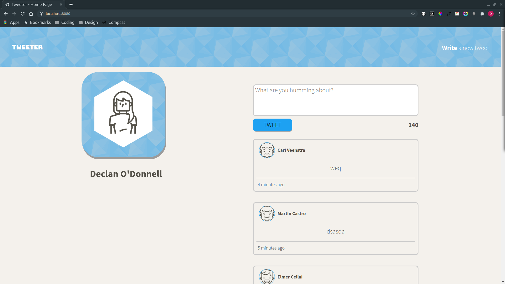
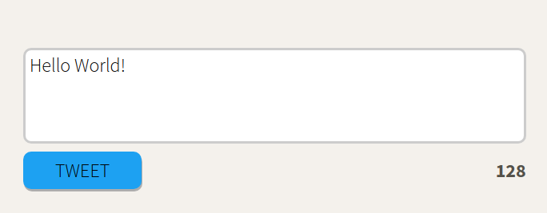
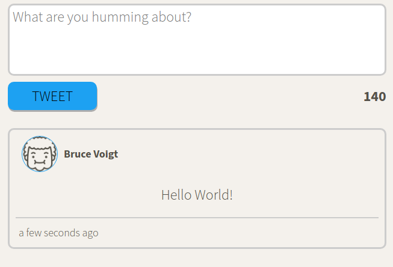
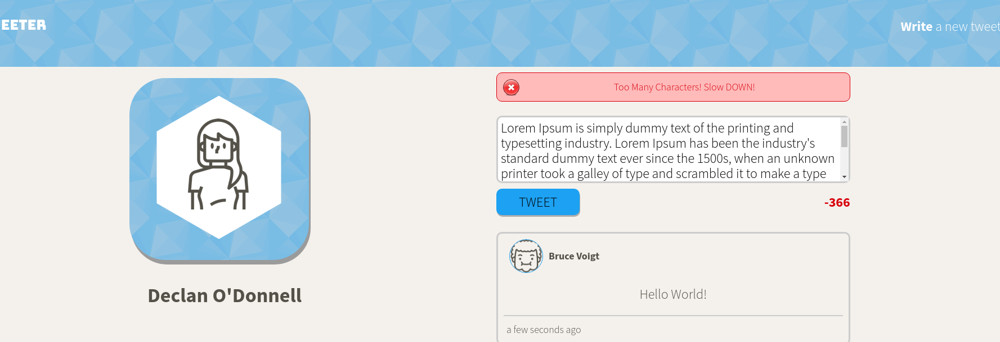
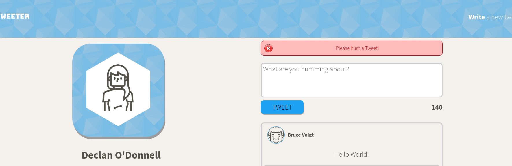
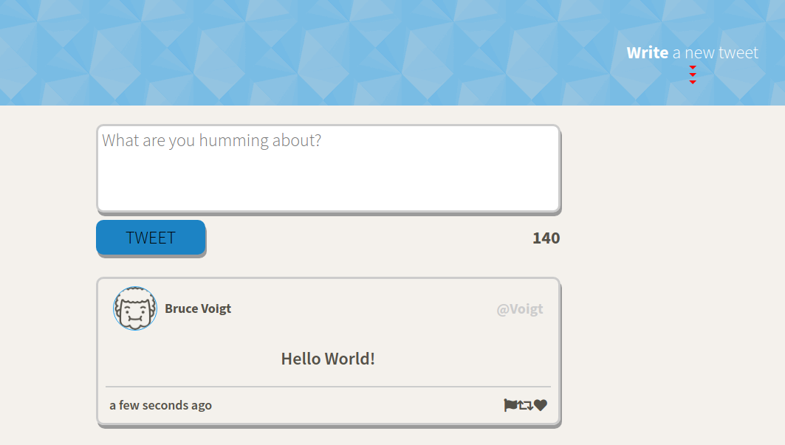
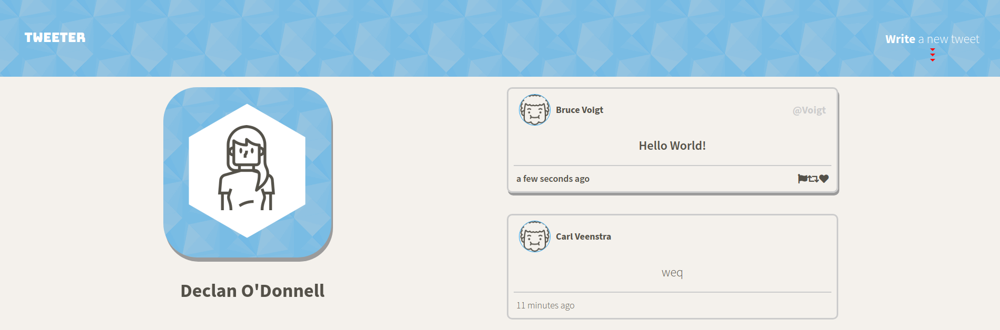
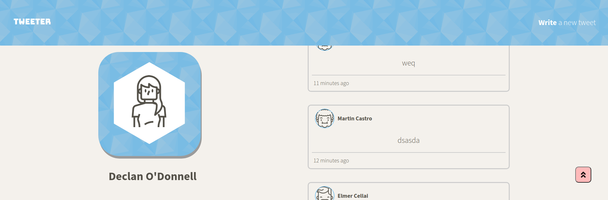
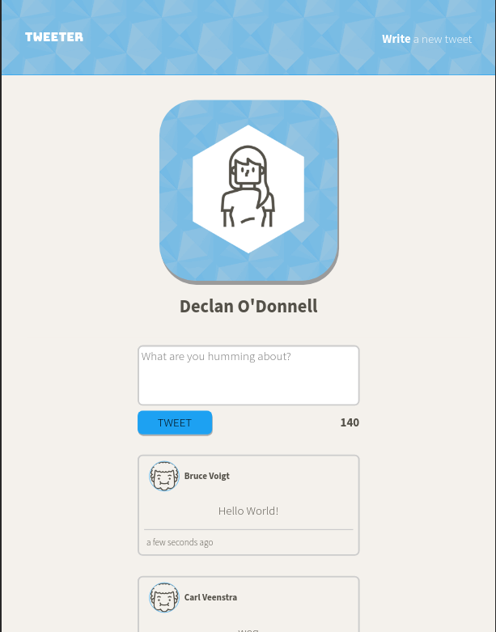

# Tweeter Project

Tweeter is a simple, single-page Twitter clone.

## Getting Started

1. Fork this repository, then clone your fork of this repository.
2. Install dependencies using the `npm install` command.
3. Start the web server using the `npm run local` command. The app will be served at <http://localhost:8080/>.
4. Go to <http://localhost:8080/> in your browser.

## Final Product

### Home Page

- Main loading page for Tweeter

### Character Count

- Built in character counter
- Turns red if characters go over 140

### Post Tweet

- Once Tweet is validated and user clicks Tweet, post is then loaded to the top of the tweet stack
- In the left corner is a timestamp as to when the post was sent
- character count is then reset as well as the textarea

### Errors

- Customizable error pop-up when validation for tweet post is not met
- When user has gone over character count

- When user enters empty tweet

- Errors have 'shake' effect if user tries to submit invalid Tweet repeatedly
- Once valid Tweet has been submitted, error slides out of view.

### Hover, Focus, Scroll Effects

- When hovering over Tweet icons and user-handle visible as well as box-shadows and bold font

- Write new Tweet animates an arrow and clickable function to hide or show new tweet area

- When scrolled down the page a clickable button fades in to scroll back to top
- Once clicked it also implements autofocus on the textarea
- If textarea is hidden from compose tweet toggle button, the scroll button slides down the new tweet area and then aut-focuses

### Responsive Design

- If on mobile or iPad Tweeter shifts the layout for a more user friendly experience
- Added Sass to help design flow and ease of use

## Dependencies

- Express
- Node 5.10.x or above
- Body-Parser
- Chance
- md5
- Moment
- Node-sass-middleware
- Sass
- Nodemon
